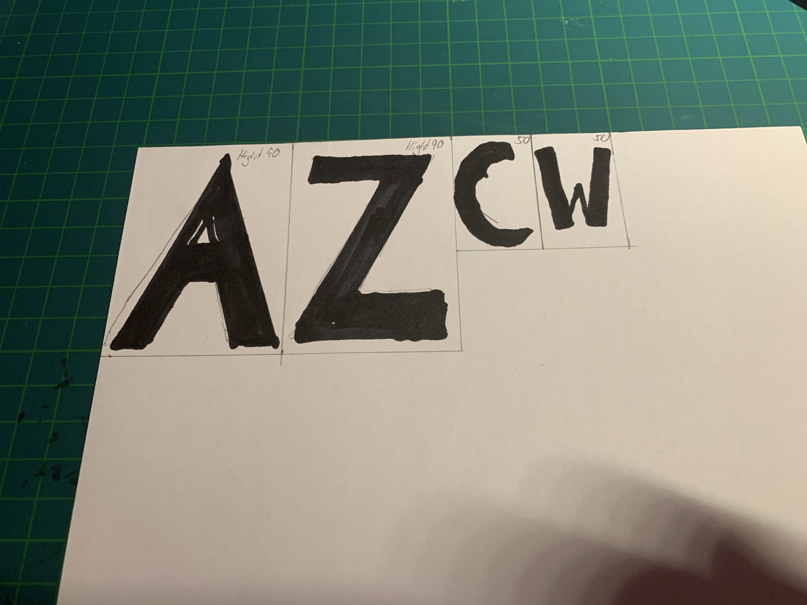
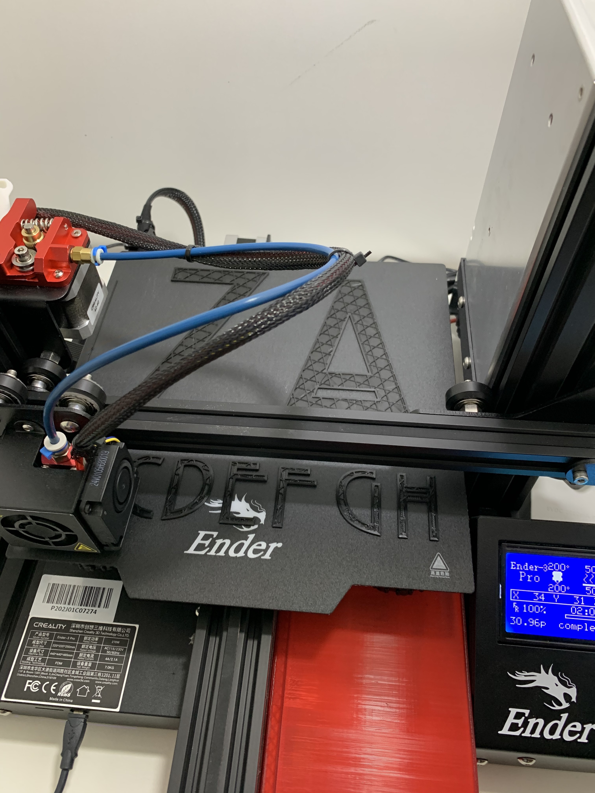
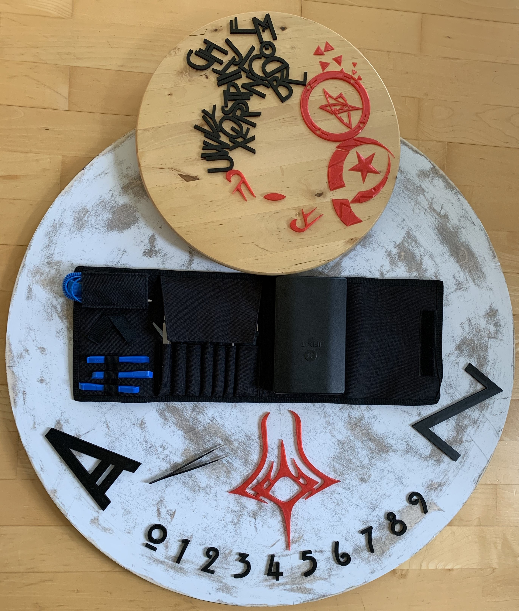
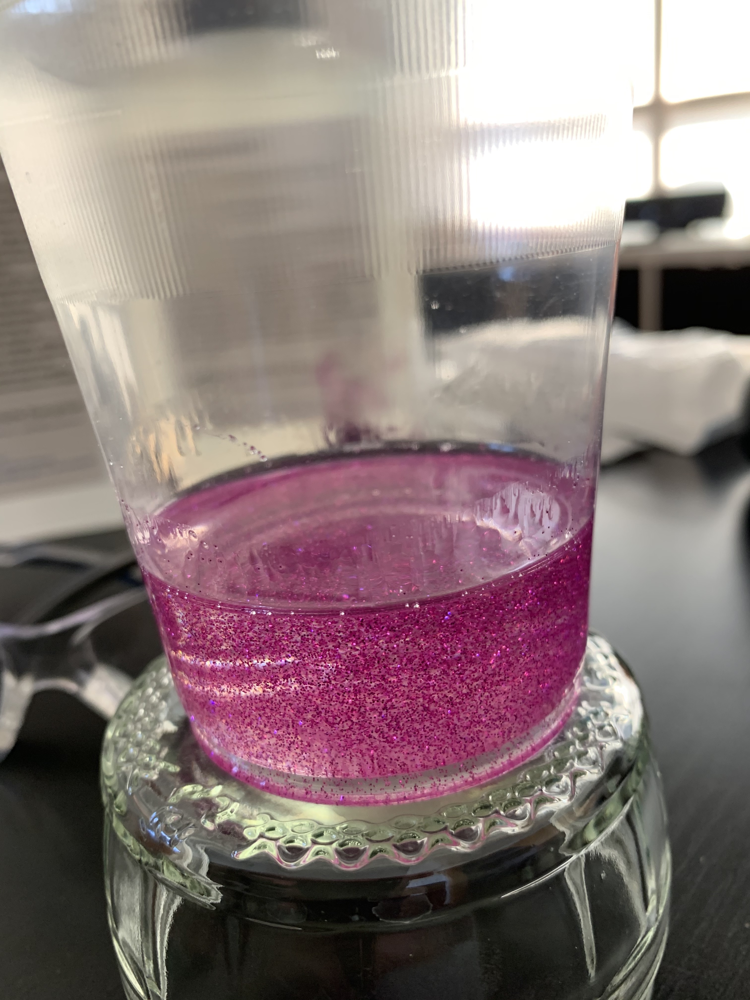

# Project:Twilight

## * Table of contents
  * [Exordium](#exordium)
  * [Twilight](#twilight)
  * [Signs](#signs)
  * [License](#license)
  * [Disclaimer, protection & security notes (must read!)](Disclaimer-protection-security-note-must-read)
  * [Lessons learned](#lessons-learned)
  * [Software](#software)
  * [Hardware](#hardware)
  * [Instructions](#instructions)
  * [Closing time](#closing-time)

---

## Exordium
An [Ouija Board](https://en.wikipedia.org/wiki/Ouija "Wikipedia Ouija") is a connection to ghosts, to lost loved and of course, to the ancient great old once. The board has the alphabet and numbers written on it as well as yes, no and goodbye.
Sometimes hello, too.
With the use of a planchette you are maybe able to get in touch with those spirits. This event is called a sêance. The board acts as a medium that lets you get a glimpse behind the curtain.
The twilight zone! If the ghosts are pleased, contact is established and you can ask questions.

You can think about whatever you want, but the basic idea is a cool thing and the design is great.
The project started like many projects. You start thinking to repair an old table that suffered away through wind and weather and a moment later you end up with the idea of creating something awesome.

There are fantastic other ways to create an Ouija Board. A fantastic one and more or less a starter for this project is [Ouija Coffee Table](https://www.instructables.com/id/Ouija-Coffee-Table/ "Instructables: Ouija Coffee Table"). This idea is fantastic and we recommend you to check it out, too.

Free your mind and let the creativity flow. There are plenty of ways out there to improve this project or do it different.
One important point is, this project includes 3D print, cause the board should have a 3Dish effect. We provide all STL files. You can print 'em on your own 3D printer or you can ask someone with one. Another way could be to use a cutting plotter but the nice 3D effect is lost.
Hope is lost? No! Explore and learn, do something new. Even if it is currently in the twilight.

## Twilight?
According to Wikipedia: [Twilight](https://en.wikipedia.org/wiki/twilight "Wikipedia Twilight") *on Earth is the illumination of the lower atmosphere when the Sun itself is not directly visible because it is below the horizon. Twilight is produced by sunlight scattering in the upper atmosphere, illuminating the lower atmosphere so that Earth's surface is neither completely lit nor completely dark.*
Furthermore, every project need a name and while "Project Ouija Board" sounds somehow lame, decision was made to call it Project:Twilight.
How are we to judge decisions, eh?

Come, join us through our journey and enter the twilight zone!

## Signs

* The Sun was inspired by the design of the Stargate from the motion picture Stargate from 1994.
* The Moon follows the idea of a fractal design, more or less.
* The Elder Sign is a 3D creation of [August Derleth](https://en.wikipedia.org/wiki/August_Derleth "Wikipedia: August Derleth")
Elder Sign version from [H.P. Lovecraft's](https://en.wikipedia.org/wiki/H._P._Lovecraft "Wikipedia: H.P. Lovecraft") magnificent [Cthulhu Mythos](https://en.wikipedia.org/wiki/Cthulhu_Mythos "Wikipedia: Cthulhu Mythos").

---

## License

This work is licensed under a [Creative Commons Attribution-NonCommercial-ShareAlike 4.0 International License](http://creativecommons.org/licenses/by-nc-sa/4.0/ "Creative Commons Attribution-NonCommercial-ShareAlike 4.0 International License").

* Allow adaptions of your work to be shared: **YES, as long as others share alike**
* Allow commercial uses of your work: **NO**

## Disclaimer, protection & security notes (must read!)
If you do not agree with the rules stop any actions!\
The author is and will not responsible for anything you do!\
Protect yourself! Think what might go wrong and how to secure you, people around you and the environment. This is important! The author does not take responsibility if something goes wrong, you hurt yourself or you slip into twilight.
Liability is completely excluded!

This article stands as a muse to kick off your own creativity universe.\
Use protective gear like glasses, gloves and masks wherever needed.\
If you use a bunsen burner take extra care! This thing is hot, it is fire and fire can hurt you or you can set something on fire. Everything of this from hurting to set fire is not tolerable! Even the resin can start to burn have always a fire extinguisher near by!\

I advice you strongly to read the instructions provided within your resin and hardener!\
While the resin hardens it can get quit hot. Don't cast and let it dry indoors cause of acrid fumes.

**!! Think before you act !!**

`THERE IS NO WARRANTY FOR THE PROJECT, TO THE EXTENT PERMITTED BY APPLICABLE LAW. EXCEPT WHEN OTHERWISE STATED IN WRITING THE COPYRIGHT HOLDERS AND/OR OTHER PARTIES PROVIDE THE PROGRAM “AS IS” WITHOUT WARRANTY OF ANY KIND, EITHER EXPRESSED OR IMPLIED, INCLUDING, BUT NOT LIMITED TO, THE IMPLIED WARRANTIES OF MERCHANTABILITY AND FITNESS FOR A PARTICULAR PURPOSE. THE ENTIRE RISK AS TO THE QUALITY AND SECURITY IS WITH YOU. SHOULD THE PROJECT PROVE DEFECTIVE, YOU ASSUME THE COST OF ALL NECESSARY SERVICING, REPAIR OR CORRECTION.`

`IN NO EVENT UNLESS REQUIRED BY APPLICABLE LAW OR AGREED TO IN WRITING WILL ANY COPYRIGHT HOLDER, OR ANY OTHER PARTY WHO MODIFIES AND/OR CONVEYS THE PROGRAM AS PERMITTED ABOVE, BE LIABLE TO YOU FOR DAMAGES, INCLUDING ANY GENERAL, SPECIAL, INCIDENTAL OR CONSEQUENTIAL DAMAGES ARISING OUT OF THE USE OR INABILITY TO USE THE PROGRAM (INCLUDING BUT NOT LIMITED TO LOSS OF DATA OR DATA BEING RENDERED INACCURATE OR LOSSES SUSTAINED BY YOU OR THIRD PARTIES OR A FAILURE OF THE PROGRAM TO OPERATE WITH ANY OTHER PROGRAMS), EVEN IF SUCH HOLDER OR OTHER PARTY HAS BEEN ADVISED OF THE POSSIBILITY OF SUCH DAMAGES.`

---

## Lessons learned

* Glue\
Standard craft glue is not sufficent. The resin releases the adhesive fixation. Maybe try superglue instead of standard glue or maybe you come up with a better solution.
* Casting\
We cast a basic layer of resin and did another one after the first layer reaches a jelly state. This worked out nicely no layers visible.
* Bubble Theorem\
We fixed bubbles in the beginning with a Crème brûlée bunsen burner. But we have to admit a few things here...\
... be careful since a this bunsen burner reaches high temperature you seal the surface quick and later air enclosures cannot reach the surface.\ Means at a certain stage you cannot get rid of those bubbles.\
... maybe try a hot air gun instead of a bunsen burner\
... the resin can get on fire if you put to much heat on it, please be super careful!\
... if you apply to much heat the surface may get yellow cause you burned it so be carful not to apply to much heat!\
... do tests before! Do not start with such a big surface!
* Glitter\
We put some glitter into the resin, works pretty well. You just need to know that 90 percent sinks down bottom.
* Resin ratio\
Double, triple check the ratio between the resin and the hardener. Otherwise it will not dry and you loose all your work.
* Resin temperature\
To dry the resin needs temps beyond 20° Celsius and under 80% humidity.
* Autodesk Fusion360 Fonts\
Fusion360 can handle *only* TTFs (True Type Fonts) on Microsoft Windows Systems. It displays all fonts imported already to your Windows OS. OTFs (Open Type Fonts) are not visible in the dropdown in Fusion360. But there are converters out in the internet where you can convert OTF to TTF. Not all work fine, but trust me it works.

## Software
* Autodesk Fusion360\
To create the numbers, letters. The moon and sun and all the other stuff.\
[AutoDesk Fusion360 (free for hobbyists) ](https://www.autodesk.de/campaigns/fusion-360-for-hobbyists "Register for free account")
* Ultimaker Cura Version 4.5\
[Ultimaker Cura (GNU Lesser General Public License v3.0) ](https://ultimaker.com/software/ultimaker-cura "Ultimaker Cura")
* Font Hill House\
This project uses the great font [Hill House](https://hicksdesign.co.uk/goodies "HICKS Design").\
According to the author: *it is free to use in every way, including embedding on websites with @font-face"*

## Hardware
* Protective Gear\
FFP3 mask, Gloves, Glasses
* 3D Printer
Creality Ender-3 Pro
* Wood stain\
Used a dark brownish environmental friendly wood stain from a hardware store
* Wood lacquer\
Used chalk paint, color "Pearl". It turned out more white than "pearl".
* Grinding machine
* Filament\
Sunlu Filament 1.75mm PLA, transparent red\
Sunlu Filament 1.75mm PLA+, black
* Wood disc (Radius 77cm)
* Tension belt
* Set square
* Lead pencil
* Rubber
* Adhesive tape
* Glue
We just use standard liquid glue, nothing special. Transparent. See "[Lessons learned](#lessons-learned)" for more info
* Pliers\
Can be very helpful, when it comes down to glue the elements down and arrange them
* Resin/Hardener\
Nothing special but a lot since the table is big.
* Glitter\
Used: Glitter powder silver and blue

## Instructions
A word about "instructions" it is up to you and this is the way this project was done.\
Again, be creative and think, thinking is sexy so put your mind to the stars.\
Read the "Lessons Learned" section again!\

| Description|
|-------------|
| `The Wood Question` Think about size and form  Doesn't matter if square or disk shape   Finally get yourself some wood |
| `Wood Protection`   To protect the wood from environmental impact we seal the complete wood with wood stain.   Two layers and please, let it dry completely.    |
|  `Prepare For Paint`  What we want is a shabby look or used or vintage, whatever you wanna call it.    Thus include we need to ruin the surface were we want to have the Ouija Board later on. Use a grinding maschine but it works with the manual way as well. It just takes much more time and effort. Grind most of the layers from the stain away. The wood stain is not the best base for the paint. Just remove the layers until you are satisfied with the result.      |
| `The Paint Job`  Chalk paint is used in this example. Chalk paint is based on minerals and water so it's the ecologic way. The color of the chalk paint is "Pearl" but it turns out to be more white than pearl. Anyway we ruin the surface later again for the used look. Again let the paint completely dry before you start anything else.    |
| `Shabby Chick`  Very similar to the "Prepare For Paint" use a grinding maschine or just grinding paper to get the look you desire.     |
| `Prepare For Print`   Dimension is a big thing in this project. You need to be happy with the result so do this again and again. Test or sketch it on paper before you start printing. This takes time, but in the end you are the responsible person if you mess it up. On the images you can see that the A and Z in the end where increased in size a lot. Better, cleaner look.        |
| `Print Job`  Now we need to use the 3D printer. You can find the STL files I created in the folder "stl-files" within this project. The files are for print beds with a dimension of X220xY220. The printer used was a Ender-3 Pro. The Z-axis is not important since the files are not higher than 60mm.       |
| `Glue Job`  If you have everything what you like place it on the board. Draw help lines to position the prints for your final result. Make a foto before you start glue them down. Standard liquid craft glue is not the best option, as "Lessons learned" should already told you. Superglue is maybe a better option but where gloves. Superglue tends to glue first all things together what you didn't want to be glue together. Thinking in the project perspective we were lucky cause we were able to push the letters and signs back to the base. Since the resin already starts to harden they did not raise again.      |
| `Stack Overflow`  Before casting the resin a frame needs to be built. For this project it was a mixture of gaffer tape duck tape and a tension belt. This is ok if you want to round the corners. If you want to have the edges straight like the wood recommendation is to use plastic or metal. Bend it around and secure it with the tension belt. That should fix the issue that the tape bends into the cask as you can see in the image:     |
| `Cast*ing Level One`   **Word on security**  You need a lot of time and if you do it outside good weather conditions, too. Two hours at least and a safe place where you can put it away if it starts raining. Yes, wind you should consider as well cause with wind travels dirt. What you don't want is dust and dirt in your resin. Inside? Be sure to do this in well ventilated room. These are chemical components, secure yourself and others! Wear gloves and a protective glasses while dealing with the components! Both tend to get hot, so choose a secure place and container.  **Word on tests**   Seriously, do tests *before*. Especially if you use glitter. You need to get a feeling before you start about temperature and time until the resins harden.  Done? Then mix the resin and the hardener according to the producers recommendations. A bucket with a spout might be a good idea. Put some glitter in it, if you want, and keep one fourth left for the "Cast*ing Level Two". Mix the resin and hardener slowly avoid creating bubbles. There are a lot of YouTube videos out they will help you get the idea. Important, again, cause bubbles is a no-go here. Level the stand before you start with the cast. You don't want to have all the resin at one side. Now pour the liquid slowly onto the Ouija Board and spread it with some tool equiliy and into the holes.     |
| `Bubble Busters`  Hardening starts after an hour for our resin. Depending on the weather conditions. We had around 20° Celsius and more or less sunlight (slightly cloudy) for two and a half hours. You need to remove dirt (outside, wind, you know) with pliers. To get rid of the air bubbles we used a Crème brûlée bunsen burner and only a short burst! <1 second. Read and understand the "Lessons learned" section again. This is dangerous since the resin can get on fire! Have a fire extinguisher near by. Furthermore you harden the surface with the heat which seals it. Maybe replace the burner with a heat gun. But if the surface is hardened no bubbles can reach the surface anymore and you cannot do anything anymore here. The rest is post process! Don't try to use any tools after the hardening process starts, you will make it even worse.  You need to stay there all the time until the bubbles stops or the surface starts to harden. Stay hydrated and where a hat in direct sunlight!    |
| `Cast*ing Level Two`  Same process like in "Level One". We did it right after the hardening process starts so the surface is slightly liquid but starts to get gelly. Not sure maybe you can do this after the first level hardened completely. But what we want is that there is no visibility between "Level One" and "Level Two". |
| `Bubble Busters`  Do the same like it is described before!   |
| `Drying`  Let the resin dry. Two days or more. Keep it in a dry, warm environment. After that remove the overflow protection.      |
| `Post Process`  We learned a lot while dealing with this project but everytime you do something new a new challenge will rise. We had some bubble enclosures. And the boarder is due to the tape not even. This process is not finished. But the idea is to grind out the bubbles and mix a small portion of resin and fill up the holes with it. We need to do some tests before. The border is just grinding. This will be updated as soon as we have a result.    |
| `Cutting Edge`  We need to get perfect circle and we need to get rid of the resin edge. If you are using a proper tape maybe you have already a nice finish. For us this was a really big dissapointment so we decided to use a milling cutter. One of my friends is perfect in creating tools. So he created a tool that is centered to the middle of the Ouija Board and with the cutter we were able to have a perfect and round table.       |
| `Bubble Busters` Oh yes, that's your major job. Getting rid of bubbles and other problematic zones. A multi tool was used to cut out these zones and the bubbles. No need to polish, just remove the dust and fill it up again with a little bit of resin. Make sure that the resin fills up the bottom of your drilled holes. Toothbick is one option.      | |

## Closing time
Thank you for your time. Stay safe and keep being creative!

... 
Closing time - Time for you to go out go out into the world. 
Closing time - Turn the lights up over every boy and every girl. 
Closing time - One last call for alcohol so finish your whiskey or beer. 
Closing time - You don't have to go home but you can't stay here. 
... 
Semisonic - Closing Time

## Thx
Without the help of friends this project wouldn't be possible so this goes out to every one of my friends but especially to MaryGold :heart: and the one and only magnificent Moondust :full_moon:. 
You are awesome and I am blessed to know you.

**DIY or DIE** - MissMaryGold & Moondust & CrimsonClyde
